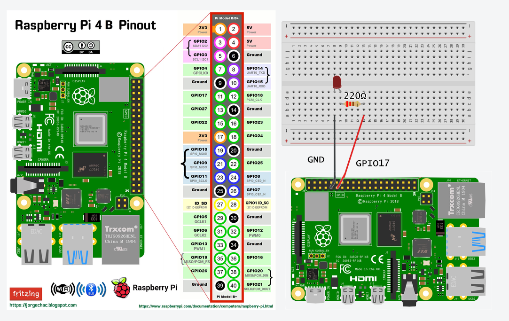

# Requirements

- Python 3.12
- dlib for python (version 19.24.6) (requires CMake)
- opencv-python (version 4.10)
- imutils (version 0.5.4)
- pygame (version 2.6.1)
- numpy (version 2.1.3) (needed for scipy)
- scipy (version 1.14.1)

tested on Ubuntu 24.04

### Optional to run Raspberry script :
  - gpiozero python library (pre-installed on Raspbian OS)
  - <a href="https://play.google.com/store/apps/details?id=com.pas.webcam">IPWebcam Android application</a> on phone to use as a camera (I don't have a Raspberry camera module)
  - X server running on local machine (if connecting to Raspberry PI with SSH)
      - Windows : install Xming and enable X11 forwarding in PuTTY (Connection > X11 > check "Enable X11 forwarding")
      - Linux : connect to SSH with `ssh -Y username@hostname`
  
# Execution
There are 3 files in `facial_rec_scripts` you can execute to test the models :
- `image_cv2_version` : will test the OpenCV model on a still image put in `./Img/`. Make sure to give the correct filename for the image you want to test : (Line 53) : `filename = "ai_generated_face.jpg"` (default image)
- `webcam_cv2_version` : will test the OpenCV model on your webcam (make sure your webcam allows access to other apps). Try to blink for it to play a beeping sound ! Blue box : face ; red box : nose ; green box : eye
- `webcam_dlib_version` : will test the dlib models on your webcam (make sure your webcam allows access to other apps). Try to blink for it to play a beeping sound !

The file `ipcam_cv2.py` in `raspberry_scripts` is just a blink detector using an LED to turn on when blinking is detected, instead of beeping sound. Uses dlib model.  
Tested on Raspberry PI 4 Model B. 

  

# Documentation
Useful documentation to understand the code and the models :
- <a href="https://docs.opencv.org/3.4/db/d28/tutorial_cascade_classifier.html">OpenCV Cascade Classifier tutorial</a>
- <a href="https://www.sciencedirect.com/science/article/pii/S2667241322000039">Eye Aspect Ratio (EAR) calculation</a>
- <a href="https://www.researchgate.net/profile/Fabrizio-Falchi/publication/338048224/figure/fig1/AS:837860722741255@1576772971540/68-facial-landmarks.jpg">68 facial landmarks (for dlib)</a>

